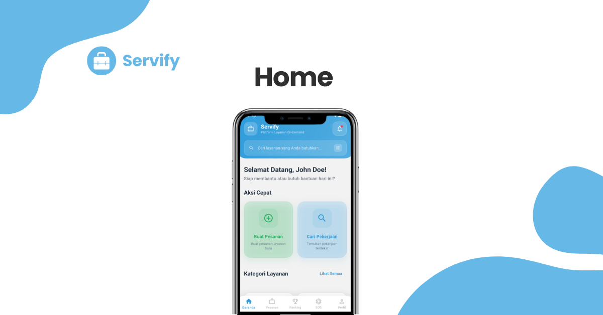
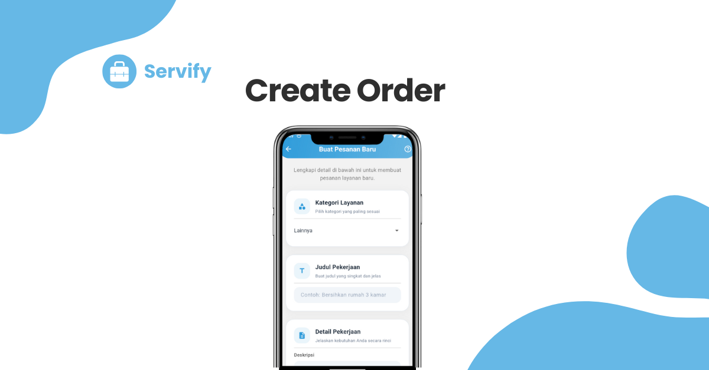
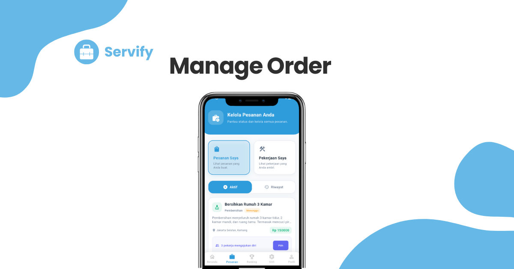
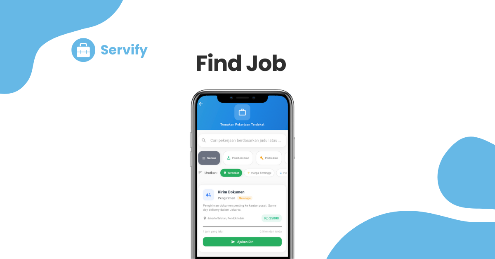
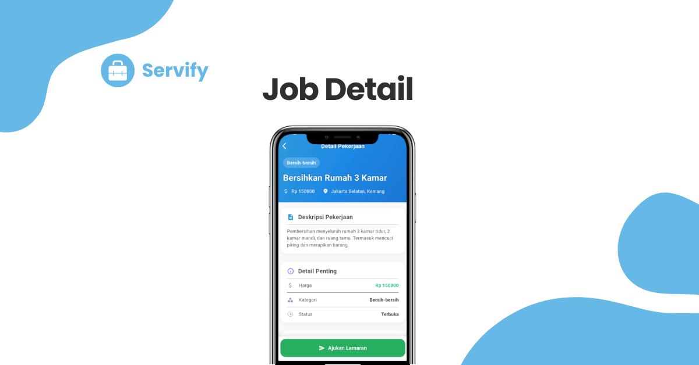
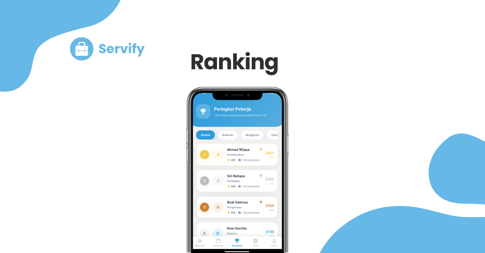
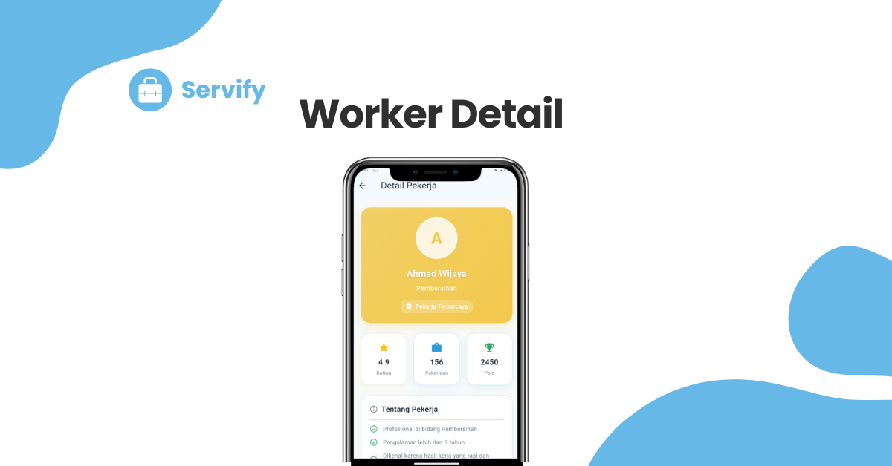
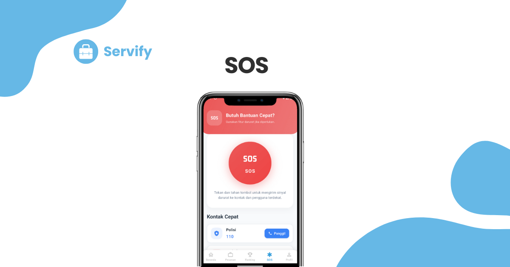
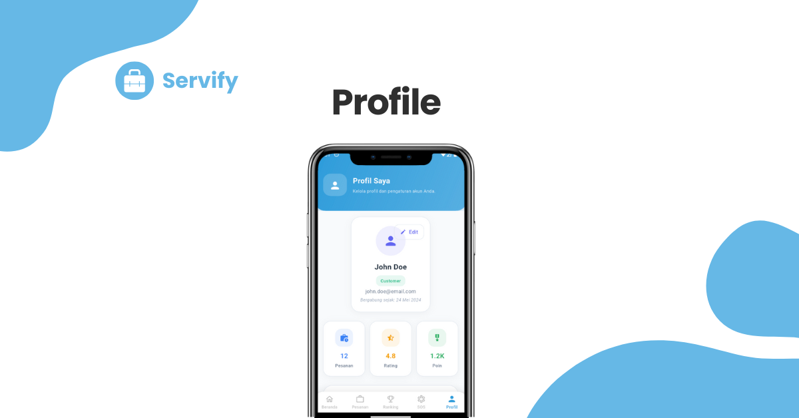

<h1 align="center">Servify</h1>

    Aplikasi mobile lintas platform yang menghubungkan pelanggan dengan penyedia jasa secara mudah dan cepat.  
    <b>Servify</b> – menyederhanakan setiap kebutuhan layanan.

### Kelompok 5
| No | Nama | NIM |
|----|------|-----|
| 1 | Jonathan Del Piero Manik | [231402095] |
| 2 | Nazwa Nabila | [231402098] | 
| 3 | Jesica Eldamaris Maha | [231402101] | 
| 4 | Susi Pujiarti | [231402122] | 
| 5 | Crosby Igresius Nainggolan | [231402125] | 
| 6 | Geri Nugraha Sitepu | [231402019] |

### Fitur :
- **Autentikasi Pengguna** – Registrasi & login untuk pelanggan dan penyedia jasa. 
- **Buat Pesanan** – Membuat permintaan layanan berdasarkan kategori dan lokasi.
- **Manajemen Pesanan** – Melihat daftar pesanan aktif dan riwayat pesanan. 
- **Sistem Peringkat** – Menampilkan penyedia jasa dengan rating tertinggi.
- **Fitur SOS** – Tombol cepat untuk menghubungi kontak darurat. 
- **Cari Pekerjaan** – Menampilkan daftar pekerjaan yang tersedia di sekitar pengguna.
- **Detail Pekerjaan** – Menampilkan informasi lengkap tentang sebuah pekerjaan yang dibuka oleh pengguna (pencari jasa).      
- **Detail Pekerja** – Menampilkan profil lengkap seorang pekerja, termasuk nama, foto, keahlian, pengalaman kerja, dan rating dari pengguna lain.   
- **Profil Pengguna** – Menampilkan data pengguna, pesanan, rating, poin, dan opsi edit profil.

### Deskripsi Project :
- **Jenis Project:** Cross-Platform Mobile Application  
- **Framework:** Flutter  
- **Bahasa Pemrograman:** Dart  
- **Backend:** Laravel  
- **Database:** MySQL
- **Code Editor:** Visual Studio Code (VS Code)  
- **Testing Platform:** Android Emulator  
- **Version Control:** Git & GitHub

### Versi Tools :
| Komponen | Versi |
|-----------|--------|
| Flutter SDK | 3.35.4 |
| Dart SDK | 3.9.2 |
| Android Studio | Ladybug (2024.2.1) |
| Visual Studio Code | 1.104.3 |
| Android SDK | 34.0.0 |
| Gradle | 8.7 |
| JDK | 21 |
| Minimum Android SDK | 21 (Lollipop) |

### Layout Dasar :
| | | |
|:--:|:--:|:--:|
|  Halaman Utama |  Buat Pesanan |  Kelola Pesanan |
|  Cari Pekerjaan |  Detail Pekerjaan |  Ranking |
|  Detail Pekerja |  Fitur SOS |  Profile | 

